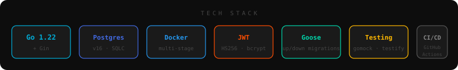
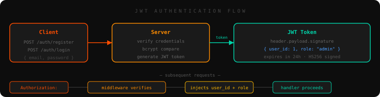
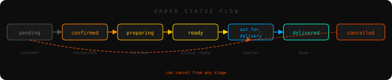

<div align="center">


# BAR 108

**A real backend for a real restaurant — built to learn, deployed to production.**

*Go · PostgreSQL · Docker · JWT · SQLC · Goose · gomock*

<br/>

[](https://go.dev)
[](https://postgresql.org)
[](https://docker.com)
[](https://github.com/bytepharaoh/Bar108/actions)
[](LICENSE)

</div>

---

Bar 108 is the backend for a restaurant in Innopolis, Russia. Customers register, browse the menu, place orders, track delivery in real time, and earn bonus points. Admins manage the menu, process orders, and assign couriers.

This started as a learning project and turned into something I'm genuinely proud of — a production-ready API with proper layered architecture, JWT auth, database transactions, comprehensive tests, and Docker deployment. Every decision is documented here so you can understand not just *what* but *why*.

---

## How it works


The codebase follows a strict three-layer pattern:

**Handlers** receive HTTP requests, parse them, and call the service. They know nothing about the database.

**Services** hold the business logic — validation, status transition rules, ownership checks, price calculations. They know nothing about HTTP.

**Repositories** talk to PostgreSQL. They know nothing about HTTP or business rules.

This separation means every layer can be tested in isolation. The handler tests use a mock service. The service tests use a mock repository. Neither touches a real database.

---

## Tech stack



|            | What               | Why                                                          |
| ---------- | ------------------ | ------------------------------------------------------------ |
| Language   | Go 1.22 + Gin      | Fast compile times, great standard library, explicit error handling |
| Database   | PostgreSQL 16      | ACID transactions, strong constraints, battle-tested         |
| Queries    | SQLC               | Write real SQL, get type-safe Go code generated — no ORM magic |
| Migrations | Goose              | Versioned up/down migrations, runs automatically at startup  |
| Auth       | JWT + bcrypt       | Stateless tokens, bcrypt for password hashing (cost 12)      |
| Testing    | gomock + testify   | Generated mocks, table-driven tests, race detector           |
| Deploy     | Docker multi-stage | 13MB final image, no Go toolchain in production              |
| CI         | GitHub Actions     | Lint + test + build on every push                            |

---

## Auth flow



Passwords are hashed with bcrypt before they ever touch the database. JWTs carry `user_id` and `role` in the payload — the server verifies the signature on every request without hitting the database. Ownership checks are enforced at the handler level: customers can only access their own orders and profiles.

---

## API reference

### Public — no token needed

| Method | Endpoint         | Description                 |
| ------ | ---------------- | --------------------------- |
| `POST` | `/auth/register` | Create account, returns JWT |
| `POST` | `/auth/login`    | Login, returns JWT          |
| `GET`  | `/menu`          | All available menu items    |
| `GET`  | `/menu/:id`      | Single menu item            |
| `GET`  | `/categories`    | All categories              |
| `GET`  | `/ping`          | Health check                |

### Customer — requires JWT

| Method  | Endpoint             | Description          |
| ------- | -------------------- | -------------------- |
| `POST`  | `/orders`            | Place an order       |
| `GET`   | `/orders/:id`        | View your order      |
| `GET`   | `/orders/:id/track`  | Full status timeline |
| `GET`   | `/orders/:id/items`  | Items in an order    |
| `PATCH` | `/orders/:id/cancel` | Cancel your order    |
| `GET`   | `/users/:id/orders`  | Your order history   |
| `GET`   | `/users/:id`         | Your profile         |
| `PUT`   | `/users/:id`         | Update your profile  |

### Admin — requires JWT with `role: admin`

| Method   | Endpoint                | Description           |
| -------- | ----------------------- | --------------------- |
| `GET`    | `/orders`               | All orders            |
| `GET`    | `/orders/pending`       | Unprocessed orders    |
| `PATCH`  | `/orders/:id/status`    | Update order status   |
| `PATCH`  | `/orders/:id/courier`   | Assign courier        |
| `POST`   | `/menu`                 | Add menu item         |
| `PUT`    | `/menu/:id`             | Update menu item      |
| `DELETE` | `/menu/:id`             | Remove menu item      |
| `GET`    | `/users`                | All users             |
| `PATCH`  | `/users/:id/activate`   | Activate user         |
| `PATCH`  | `/users/:id/deactivate` | Deactivate user       |
| `GET`    | `/couriers`             | All couriers          |
| `PATCH`  | `/couriers/:id/status`  | Update courier status |

---

## Order flow



Status transitions are validated at the service layer — you can't skip states or go backwards. Every change is recorded in `order_status_history` with a timestamp, giving customers a full timeline when they track their order.

---

## Running locally

You need Go 1.22+, Docker, and that's it. Everything else runs in containers.

```bash
git clone https://github.com/bytepharaoh/Bar108.git
cd Bar108
cp .env.example .env
```

Open `.env` and fill in your values — pay attention to `JWT_SECRET`, it should be a long random string:

```bash
openssl rand -hex 32   # generates a good secret
```

Start PostgreSQL and run migrations:

```bash
make db-up
make migrate-up
```

Start the server:

```bash
make run
```

Test it's alive:

```bash
curl http://localhost:8080/ping
# {"status":"ok","message":"pong"}
```

Register an account and grab your token:

```bash
curl -X POST http://localhost:8080/auth/register \
  -H "Content-Type: application/json" \
  -d '{"name":"Ahmed","phone":"+79001234567","email":"you@example.com","password":"secret123"}'
```

Use the token to place an order:

```bash
curl -X POST http://localhost:8080/orders \
  -H "Authorization: Bearer YOUR_TOKEN" \
  -H "Content-Type: application/json" \
  -d '{"user_id":1,"items":[{"menu_item_id":1,"quantity":2}]}'
```

---

## Running with Docker

This builds a ~13MB production image using multi-stage builds — no Go toolchain, no source code, just the binary.

```bash
cp .env.example .env
# fill in .env values

docker compose up -d
docker compose logs -f app
```

You should see:

```
bar108_app | database: connected successfully
bar108_app | database: migrations applied successfully
bar108_app | server: listening on :8080
```

Migrations run automatically at startup — you don't need Goose installed.

To rebuild after code changes:

```bash
docker compose up -d --build app
```

To stop everything:

```bash
docker compose down
```

---

## Development commands

```bash
make run             # start the server
make build           # compile to ./bin/
make fmt             # format all Go files
make lint            # run golangci-lint
make check           # fmt + vet + lint (run before committing)
make test            # all tests with race detector
make test-coverage   # tests + open coverage report in browser
make mocks           # regenerate all gomock mocks
make sqlc            # regenerate SQLC code from SQL queries
make db-up           # start PostgreSQL
make db-down         # stop PostgreSQL
make db-shell        # open psql
make migrate-up      # apply pending migrations
make migrate-down    # roll back last migration
make migrate-status  # show migration history
make docker-up       # start everything (db + app)
make docker-down     # stop everything
make docker-logs     # follow app logs
make docker-restart  # rebuild and restart app
```

---

## Environment variables

| Variable           | Description          | Example          |
| ------------------ | -------------------- | ---------------- |
| `APP_PORT`         | HTTP port            | `8080`           |
| `APP_ENV`          | Environment          | `development`    |
| `DB_HOST`          | PostgreSQL host      | `localhost`      |
| `DB_PORT`          | PostgreSQL port      | `5432`           |
| `DB_USER`          | Database user        | `bar108_user`    |
| `DB_PASSWORD`      | Database password    | `bar108_pass`    |
| `DB_NAME`          | Database name        | `bar108_db`      |
| `DB_SSLMODE`       | SSL mode             | `disable`        |
| `JWT_SECRET`       | Token signing secret | 32+ random chars |
| `JWT_EXPIRY_HOURS` | Token lifetime       | `24`             |

---

## Testing

Tests cover every layer independently — handlers, services, and soon the repository layer against a real test database.

```bash
make test
```

```
--- PASS: TestOrderService_UpdateOrderStatus/invalid_transition_—_delivered_to_pending
--- PASS: TestOrderService_AssignCourier/order_not_ready_—_pending
--- PASS: TestUserService_DeactivateUser/has_active_orders_—_conflict
--- PASS: TestMenuHandler_CreateMenuItem/missing_required_fields_—_400
--- PASS: TestOrderHandler_CancelOrder/forbidden_—_customer_cancels_other_user_order
```

Every test function covers the full range — happy path, not found, invalid input, edge cases, business rule violations, and database errors. Table-driven style keeps things readable as cases grow.

---

## License

MIT — do whatever you want with it. See [LICENSE](LICENSE).

---

<div align="center">


Built By: Ziad Mohamed(BytePharaoh)
</div>