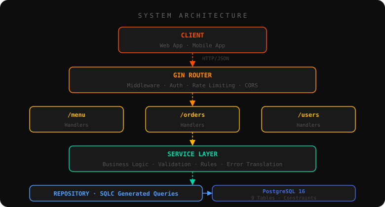
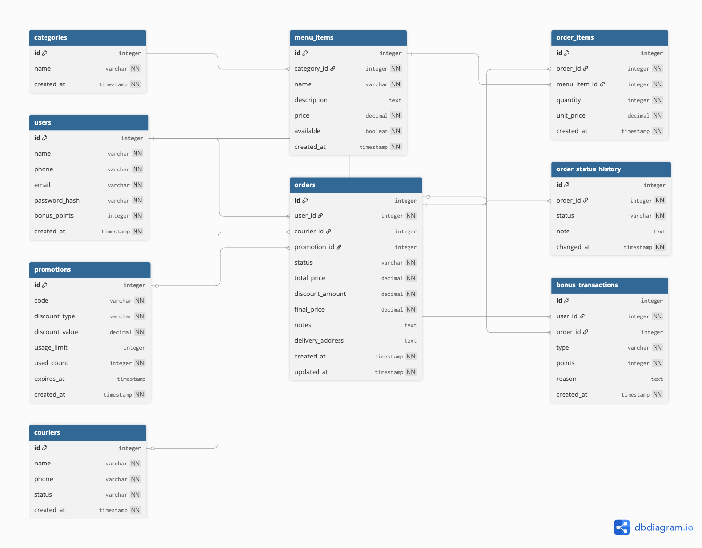

<div align="center">


# BAR 108

### `Production-Grade Restaurant Ordering Backend`

*Built with Go · PostgreSQL · Docker · SQLC · JWT*

<br/>

<!-- Badges -->


<br/>

</div>

---

## What is this?

**Bar 108** is a real-world backend system for a restaurant located in **Innopolis, Russia**. Customers can browse the menu, place orders, track delivery in real time, and earn loyalty points. Built from scratch as a learning project — but engineered like production.

> *"Start simple. Avoid over-engineering. Build something real."*

---

## Architecture



---

## Tech Stack

<div align="center">

| Layer | Technology | Why |
|---|---|---|
| Language | **Go 1.21** | Fast, simple, great for APIs |
| Web Framework | **Gin** | Most popular Go HTTP framework |
| Database | **PostgreSQL 16** | Reliable, ACID-compliant |
| Query Layer | **SQLC** | Type-safe SQL → generated Go code |
| Auth | **JWT** | Stateless authentication |
| Containerization | **Docker + Compose** | Reproducible environments |
| Migrations | **Goose** | Versioned up/down migrations |
| Linter | **golangci-lint** | Catch bugs before runtime |
| Testing | **testify + mocks** | Full coverage, no real DB needed |

</div>

---

## Database Schema



**9 Tables:** `users` · `categories` · `menu_items` · `promotions` · `couriers` · `orders` · `order_items` · `order_status_history` · `bonus_transactions`

Key design decisions:
- **Soft deletes** — users are deactivated, never deleted
- **Price snapshots** — `unit_price` stored per order item, not referenced live
- **Status history** — every order status change is logged with a timestamp
- **Bonus transactions** — full audit log of points earned and redeemed

---

## Project Structure

```
bar108/
├── cmd/
│   └── main.go                  # Entry point
├── config/
│   └── config.go                # Env-based configuration
├── db/
│   ├── migrations/              # Goose up/down SQL migrations
│   └── queries/                 # Raw SQL → SQLC reads these
│       ├── menu.sql
│       └── users.sql
├── internal/
│   ├── db/                      # SQLC generated code (never edit)
│   │   ├── models.go
│   │   ├── querier.go
│   │   ├── menu.sql.go
│   │   └── users.sql.go
│   ├── repository/              # Database access layer
│   │   ├── mocks/               # Mock implementations for testing
│   │   ├── menu_repository.go
│   │   └── users_repository.go
│   ├── services/                # Business logic layer
│   │   ├── menu_service.go
│   │   ├── menu_service_test.go
│   │   ├── user_service.go
│   │   └── user_service_test.go
│   └── handlers/                # HTTP handlers (coming soon)
├── .env.example                 # Environment variable template
├── .golangci.yml                # Linter config
├── docker-compose.yml           # PostgreSQL container
├── Makefile                     # Dev shortcuts
└── sqlc.yaml                    # SQLC config
```

---

## API Endpoints

### Menu
| Method | Endpoint | Description | Auth |
|---|---|---|---|
| `GET` | `/menu` | Get all available menu items | Public |
| `GET` | `/menu/:id` | Get a single menu item | Public |
| `GET` | `/menu/categories` | Get all categories | Public |
| `POST` | `/menu` | Create a menu item | Admin |
| `PUT` | `/menu/:id` | Update a menu item | Admin |
| `DELETE` | `/menu/:id` | Delete a menu item | Admin |

### Orders
| Method | Endpoint | Description | Auth |
|---|---|---|---|
| `POST` | `/orders` | Place a new order | User |
| `GET` | `/orders/:id` | Get order details + status | User |
| `GET` | `/orders/:id/track` | Get full order status history | User |
| `PATCH` | `/orders/:id/status` | Update order status | Admin |

### Users
| Method | Endpoint | Description | Auth |
|---|---|---|---|
| `POST` | `/auth/register` | Register new user | Public |
| `POST` | `/auth/login` | Login and get JWT | Public |
| `GET` | `/users/:id` | Get user profile | User |
| `PUT` | `/users/:id` | Update user profile | User |

---

## Order Flow

<div align="center">

```
  Customer places order
          │
          ▼
      [pending]
          │
          ▼ Restaurant confirms
      [confirmed]
          │
          ▼ Kitchen starts
      [preparing]
          │
          ▼ Ready for pickup
       [ready]
          │
          ▼ Courier picks up
  [out_for_delivery]
          │
          ▼ Customer receives
      [delivered]

  ─── Can cancel at any stage ──► [cancelled]
```

</div>

---

## Getting Started

### Prerequisites

```bash
go version    # 1.21+
docker --version
goose --version
sqlc version
golangci-lint --version
```

### 1 — Clone & configure

```bash
git clone https://github.com/YOUR_USERNAME/bar108.git
cd bar108

# Copy the env template and fill in your values
cp .env.example .env
```

### 2 — Start the database

```bash
make db-up
```

### 3 — Run migrations

```bash
make migrate-up
```

### 4 — Start the server

```bash
make run
```

### 5 — Test it

```bash
curl http://localhost:8080/ping
# {"message":"pong"}
```

---

## Development Commands

```bash
make run            # Start the server
make build          # Compile binary to ./bin/
make fmt            # Format all Go files
make lint           # Run golangci-lint
make check          # fmt + vet + lint (run before every commit)
make test           # Run all tests with race detector
make test-coverage  # Run tests + open coverage in browser
make db-up          # Start PostgreSQL container
make db-down        # Stop PostgreSQL container
make db-shell       # Open psql interactive shell
make migrate-up     # Apply all pending migrations
make migrate-down   # Roll back last migration
make migrate-status # Show migration history
make sqlc           # Regenerate Go code from SQL queries
make help           # List all available commands
```

---

## Testing Philosophy

Every layer is tested in isolation:

```
Repository layer  →  real test database
Service layer     →  mocked repository (no DB needed)
Handler layer     →  HTTP test requests (coming soon)
```

Every function is tested for **all cases** — not just the happy path:

- ✅ Happy path
- ✅ Not found
- ✅ Invalid input (empty, whitespace, negative, zero)
- ✅ Edge cases (already active, already inactive, has active orders)
- ✅ Database errors (connection issues, constraint violations)
- ✅ Auth errors (coming with JWT phase)

```bash
make test
# --- PASS: TestCreateUser_HappyPath
# --- PASS: TestCreateUser_BonusPointsAlwaysZero
# --- PASS: TestDeactivateUser_HasActiveOrders
# ... and many more
```

---

## Environment Variables

Copy `.env.example` to `.env` and configure:

```env
# Server
APP_PORT=8080
APP_ENV=development

# Database
DB_HOST=localhost
DB_PORT=5432
DB_USER=bar108_user
DB_PASSWORD=bar108_pass
DB_NAME=bar108_db
DB_SSLMODE=disable
```

---

## Roadmap

- [x] Project setup — Gin, folder structure, Makefile
- [x] Database schema — 9 tables, constraints, seed data
- [x] Goose migrations — versioned up/down
- [x] SQLC — type-safe query generation
- [x] Repository layer — menu + users
- [x] Service layer — business logic + validation
- [x] Unit tests — mocks, all edge cases
- [ ] HTTP Handlers — request parsing + responses
- [ ] JWT Authentication — register, login, middleware
- [ ] Order system — place, track, update status
- [ ] Courier assignment
- [ ] Bonus points system
- [ ] Promotions & discount codes
- [ ] Docker multi-stage build
- [ ] Production deployment

---

## Learning Outcomes

This project is being built step by step as a real learning journey:

- **Backend architecture** — layered design (handler → service → repository)
- **Database design** — normalized schema, constraints, foreign keys
- **Type-safe SQL** — writing real SQL and generating Go from it
- **Error handling** — sentinel errors, wrapping, translation between layers
- **Testing** — mocks, table-driven tests, edge cases
- **API development** — REST conventions, status codes, validation
- **DevOps basics** — Docker, environment config, Makefile automation

---

<div align="center">

**Bar 108** · Innopolis, Russia

*Built with 🧡 and a lot of `go run`*

</div>
